# **Predicting presence of Amphibians using GIS and Satellite images**

This is the Capstone project for the **Machine Learning Engineer with Microsoft Azure** Nanodegree program from Udacity. 

This project uses **Microsoft Azure Machine Learning** to configure, deploy and consume a machine learning model. 

In this project we are using both, the **Hyperdrive** and **Auto ML** APIs to train the models. 
The best of these models is deployed as an endpoint. The model endpoint is then tested to verify that it is working as intended by sending HTTP requests. 

We can choose any model and any data for the project, but the dataset needs to be external and not available in the Azure's ecosystem. 

The dataset used for the project was obtained from **Machine Learning Repository** at **University of California**.

The diagram below outlines the steps performed as part of the project:


<br/>

## **Dataset**

### Overview
*TODO*: Explain about the data you are using and where you got it from.

The dataset used for the project is the **Amphibians Data Set** available from Machine Learning Repository at University of California, Irvine. 

Here is the dataset summary:


### Task
*TODO*: Explain the task you are going to be solving with this dataset and the features you will be using for it.

The goal of the project is to predict the presence of amphibians species near the water reservoirs based on features obtained from Geographic Information System (GIS) and satellite images

The snapshot of the dataset is below:


The dataset is multilabel and can be used to predict presence of a number of amphibian species in water reservoirs.

Here is the description of the features within the Amphibians Data Set:


In this project we will be using the dataset to predict the presence of **Green frogs** (**Label 1**).


The dataset was downloaded using the following link:  http://archive.ics.uci.edu/ml/datasets/Amphibians

### Access
*TODO*: Explain how you are accessing the data in your workspace.

The dataset has been downloaded from the Machine Learning Repository at the Center for Machine Learning and Intelligent Systems, University of California, Irvine.

After convering to CSV format the Amphibians Data Set was uploaded to the GitHub repository.

Within the Jupyter notebooks the data is accessed via the raw file URL and converted to Dataset format using **Tabular** attribute as follows:

```
data_loc = "https://raw.githubusercontent.com/arees88/ML_Azure_P3_Capstone/main/Amphibians_dataset_green_frogs.csv"
dataset = Dataset.Tabular.from_delimited_files(data_loc)
```

In addition I have created sample data input file for testing ONNX runtime which is accessed in a similar way in the AutoML notebook:

```
test_data = "https://raw.githubusercontent.com/arees88/ML_Azure_P3_Capstone/main/Amphibians_testset.csv"
test_dataset = Dataset.Tabular.from_delimited_files(test_data)
```
Below are the screenshots from the ML Studio showing the __Amphibians Dataset__ has been created as expected:

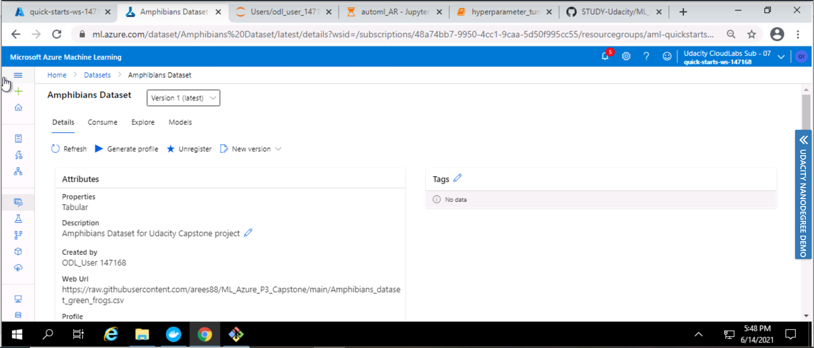

Contents of the created Dataset:

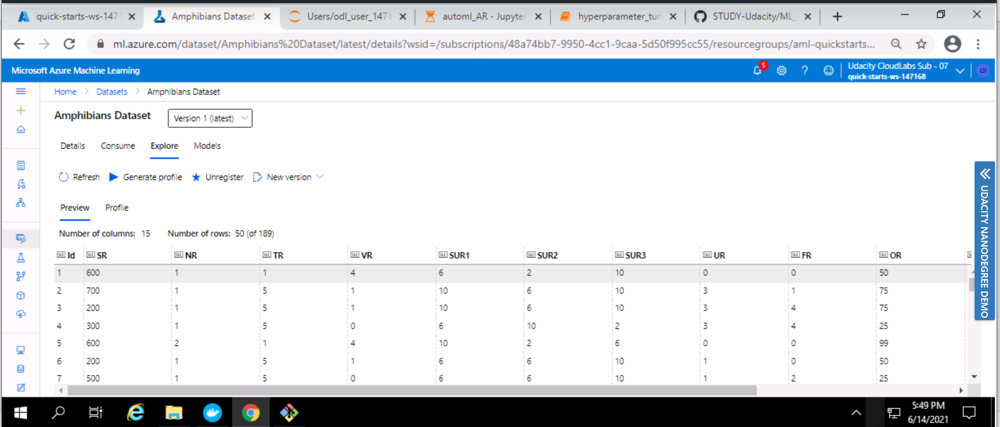

<br/>

## **Automated ML**

*TODO*: Give an overview of the `automl` settings and configuration you used for this experiment

In the first part of the project **AutoML API** is used to train the models.

The following configuration was used for the AutoML run:
```
# automl settings 
automl_settings = {
    "enable_early_stopping": True,
    "experiment_timeout_minutes": 30,
    "max_concurrent_iterations": 4,
    "featurization": 'auto',
    "primary_metric": 'accuracy',
    "verbosity": logging.INFO,
    "n_cross_validations": 4
}

# Automl config 
automl_config = AutoMLConfig(  
                    task = "classification",
                    compute_target = compute_cluster, 
                    training_data = dataset,
                    label_column_name = "Label1",   
                    debug_log = "automl_errors.log",
                    enable_onnx_compatible_models = True,
                    **automl_settings  
)
```

The early termination flag was set to true and the timeout was set to 30 minutes to limit the AutoML run duration.

The maximum iterations concurrency was set to 4, as the maximum nodes configured in the compute cluster must be greater than the number of concurrent operations in the experiment, and the compute cluster has 5 nodes configured. 

Accuracy was selected as the primary metric. The AutoML is configured to perform 4 cross validations.

As I am predicting the presence of Green frogs in water reservoirs the label column is set to ``Label1``.

I have also set the **enable_onnx_compatible_models** parameter to true as later I would like to convert the best model to ONNX format.

### Results
*TODO*: What are the results you got with your automated ML model? What were the parameters of the model? How could you have improved it?

*TODO* Remeber to provide screenshots of the `RunDetails` widget as well as a screenshot of the best model trained with it's parameters.

The AutoML experiment completed in 29 minutes as it reached the stopping criteria (`experiment_timeout_minutes=30`).

During this time AutoML performed 58 iterations evaluating diffrent models. The best performing model was `VotingEnsemble` with accuracy `0.7458`:
```
ITERATION   PIPELINE                                       DURATION      METRIC      BEST
       58   VotingEnsemble                                 0:01:15       0.7458    0.7458
```
Here is the screenshot of the best model trained with its parameters:


Below is the screenshot of the completed AutoML experiment with the details of the Best model.

- Screenshot of **RunDetails** widget showing progress of the AutoML training runs:

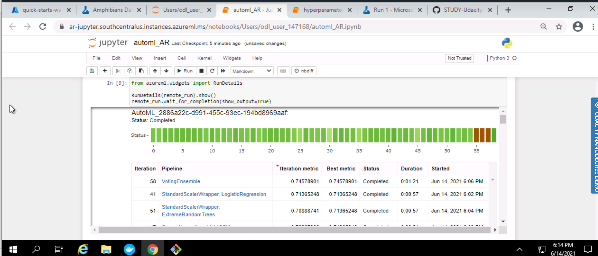

[comment]: # (screenshots/2.2_AutoML_RunDetails_Zoom_121939452-f2ce2b00-cd44-11eb-8719-e8dfcc406cd3.png)

- Illustration of AutoML run with varying accuracy metric for the different models being evaluated:

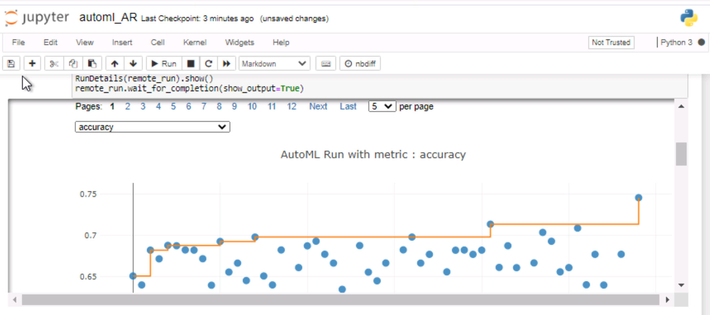

- Screenshot of the **Best model** with its run id:

[//]: # (screenshots/3.1_AutoML_Best_model_121941266-f498ee00-cd46-11eb-801e-87e60f898752.png)

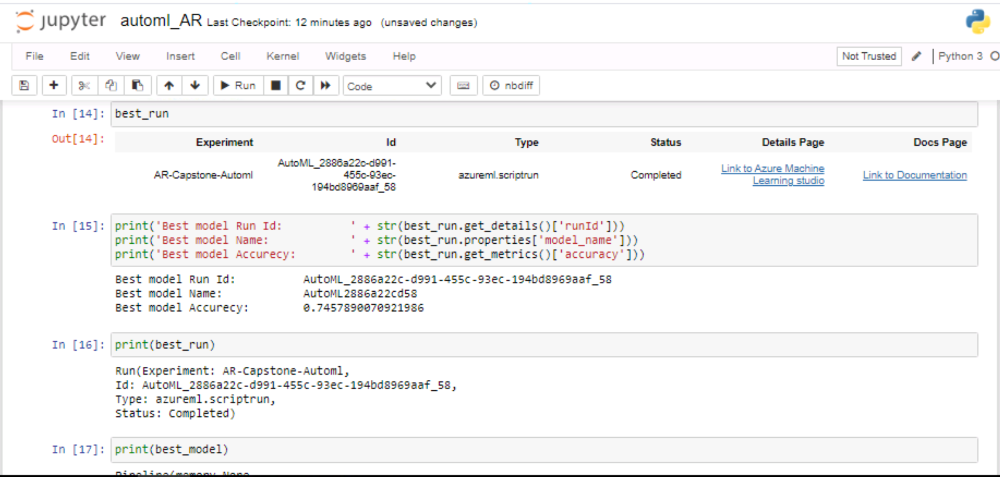

- Screenshot showing the Best AutoML model in the ML Studio screen:

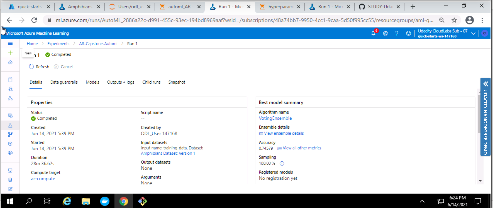

With the AutoML configuration we restricted the experiment time to 30 minutes which allowed for 58 models to be explored. 
Increasing the experiment time would potentially allow to find another, better performing model.

<br/>

## **Hyperparameter Tuning**
*TODO*: What kind of model did you choose for this experiment and why? Give an overview of the types of parameters and their ranges used for the hyperparameter search

In the second part of the project **Hyperdrive API** is used to tune the model hyperparameters. I am using the __RandomForestClassifier__ model.

I have defined three hyperparameters in the training script **train.py** which can be passed to create the **RandomForestClassifier** model:
```
	parser.add_argument('--n_estimators',   type=int, default=20,   help="Number of trees in the forest")
	parser.add_argument('--max_leaf_nodes', type=int, default=60,   help="Grow trees with max_leaf_nodes")
	parser.add_argument('--class_weight',   type=str, default=None, help="Weights associated with classes")
```

#### Parameter Sampling

Azure ML supports three types of parameter sampling - Random, Grid and Bayesian sampling.

I am using the **RandomParameterSampling** method to tune the following three hyperparameters of the __RandomForestClassifier__ model:
```
	--n_estimators      - Number of trees in the forest
	--max_leaf_nodes    - Grow trees with max_leaf_nodes
	--class_weight      - Weights associated with classes
```
I have chosen Random Parameter Sampling because it is faster and supports early termination of low-performance runs.
It supports discrete and continous hyperparameters. 

The **_n_estimators_** and **_max_leaf_nodes_** hyperparameters are of type integer and I have used choice to specify several discrete integer values for them.
The **_class_weight_** is of type string and I have specified two descrete choice values for this hyperparameter in the sampler as follows:
```
	# Specify parameter sampler
	ps = RandomParameterSampling({
		"--n_estimators":    choice(30, 40, 60, 80, 100, 120),
		"--max_leaf_nodes":  choice(50, 60, 100),
		"--class_weight":    choice('balanced', 'balanced_subsample')
	})
```
In random sampling, hyperparameter values are chosen randomly, thus saving a lot of computational efforts.
It can also be used as a starting sampling method as we can use it to do an initial search and then continue with other sampling methods.

#### Eearly Termnination Policy

The purpose of early termination policy is to automatically terminate poorly performing runs so we do not waste time and resources for the experiment. 
There are a number of early termination policies such as BanditPolicy, MedianStoppingPolicy and TruncationSelectionPolicy. 

For the project I have chosen the **BanditPolicy** based on the slack factor which is the mandatory parameter.
I have also specified optional parameters, evaluation interval and delay evaluation as follows:
```
policy = BanditPolicy (slack_factor = 0.1, evaluation_interval = 1, delay_evaluation = 5)
```
The above policy is defined to check the job at every iteration after the initial delay of 5 evaluations. 
If the primary metric (accuracy) falls outside of the top 10% range, Azure ML will terminate the job. 

The early termination policy ensures that only the best performing runs will execute to completion and hence makes the process more efficient.

### Hyperdrive configuration

I have used two versions of the Hyperdrive configuration, one is using the **SKLearn** class, and the other is using the **ScriptRunConfig** class.

#### Version 1

This is the Hyperdrive configuration where the **SKLearn** estimator is created for use with **train.py** script:


As seen above, the 'SKLearn' estimator is deprecated and we are advised to use the 'ScriptRunConfig' from 'azureml.core.script_run_config' instead.

#### Version 2

This is the Hyperdrive configuration using **ScriptRunConfig** class to set configuration information for submitting a training run in Azure Machine Learning.


The primary metric is **Accuracy** which is set in the **train.py** script. BanditPolicy is configured as the early termination policy for the run.


### Results
*TODO*: What are the results you got with your model? What were the parameters of the model? How could you have improved it?

*TODO* Remeber to provide screenshots of the `RunDetails` widget as well as a screenshot of the best model trained with it's parameters.

The Hyperdrive run configured with ScriptRunConfig class took 42 minutes to run.

It identified the Best model hyperparameters as follows:
```
'--class_weight':     'balanced'
'--max_leaf_nodes':   '50'
'--n_estimators':     '60'

	 Number of trees : 60
	 Max leaf nodes : 50
	 Class weights : balanced
```

- Screenshot of the **RunDetails** widget showing progress of the Hyperdrive training runs:

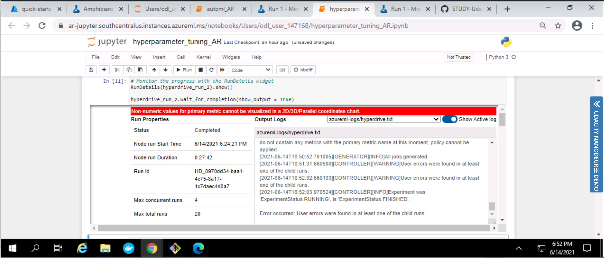

- Screenshot showing details of the best performing Hyperdrive runs. Three hyperdrive models achived similar accuracy of 0.78947368:

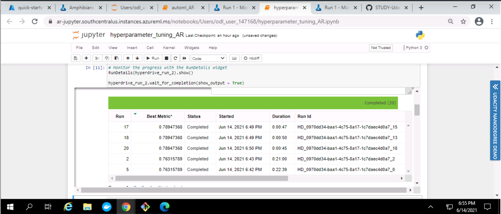

- Screenshot showing the pop-up for one of the best performing models:

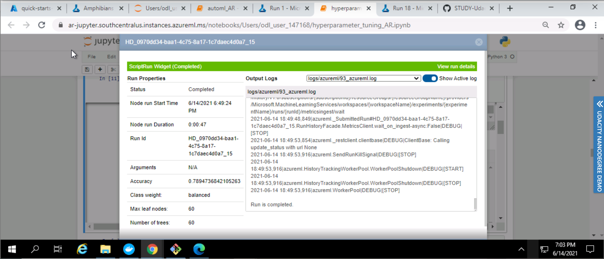

[//]: # (screenshots/4.4_HyperDrive_RunDetails_Popup_Zoom_121945472-bb16b180-cd4b-11eb-8751-660b11882bc9.png)

- Parallel coordinate chart of model performance with various hyperparameters values:

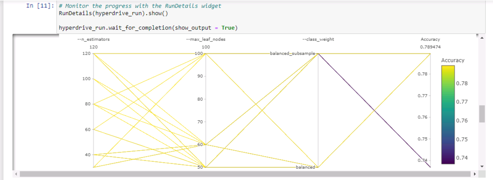

- Screenshot of the **Best model** with its run id and the different hyperparameters that were tuned:

[//]: # (screenshots/5.1_HyperDrive_Best_model_121945025-37f55b80-cd4b-11eb-9cfd-ec607d8d07be.png)

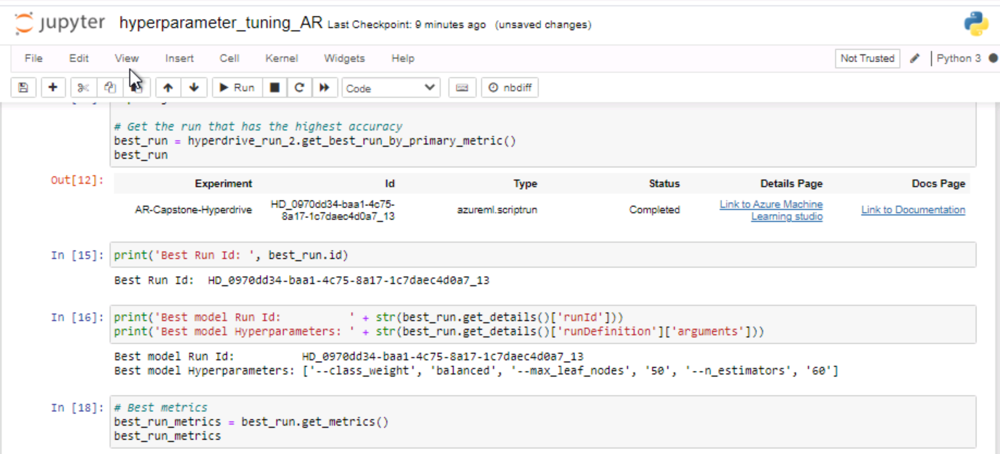

- Screenshot showing the Best Hyperdrive model in the ML Studio screen:

[//]: # (screenshots/4.5_HyperDrive_RunDetails_Studio_121944820-ffee1880-cd4a-11eb-87a6-71cbe74e99c5.png)

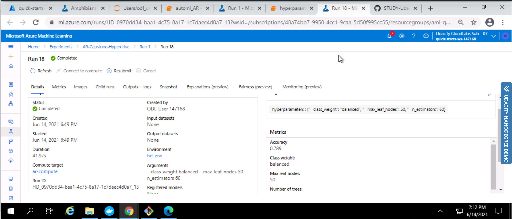

Increasing the **_max_total_runs_** parameter for the experiment would potentially allow to find another, better performing model hyperparameter combination.

In addition to the larger number of runs, an increased number of hyperparameters and a wider choice for search ranges is likely to improve performance as well. 

<br/>

## **Model Deployment**
*TODO*: Give an overview of the deployed model and instructions on how to query the endpoint with a sample input.

### **Best Models Comparison**

Below is the screenshot from the Jupyter notebook listing the registered models after AutoML and Hyperdrive runs completed:


[//]: # (https://user-images.githubusercontent.com/60096624/122614038-c6384d00-d07d-11eb-8ca1-d0e2a83c8aed.png)

Comparing the accuracy of the registered best AutoML and Hyperdrive models, we can see that the latter performed better:
```
automl_best_model Accuracy:  0.74578900
hyper_best_model Accuracy:   0.78947368
```
To this end I have deployed the best Hyperdrive model as the endpoint.

- Screenshot showing the Best Hyperdrive model has been deployed successfully:

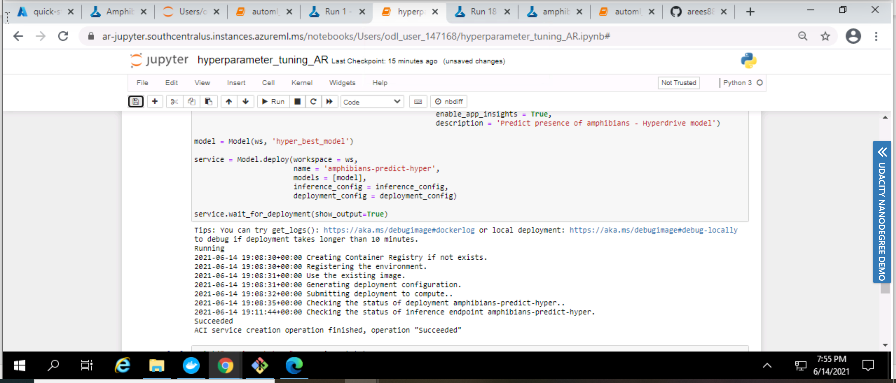

[//]: # (screenshots/6.2_Hyper_Deployment_Zoom_121951711-2e6ff180-cd53-11eb-9237-78c08ae45576.png)

- Screenshot showing the model endpoint has been created in the ML Studio:

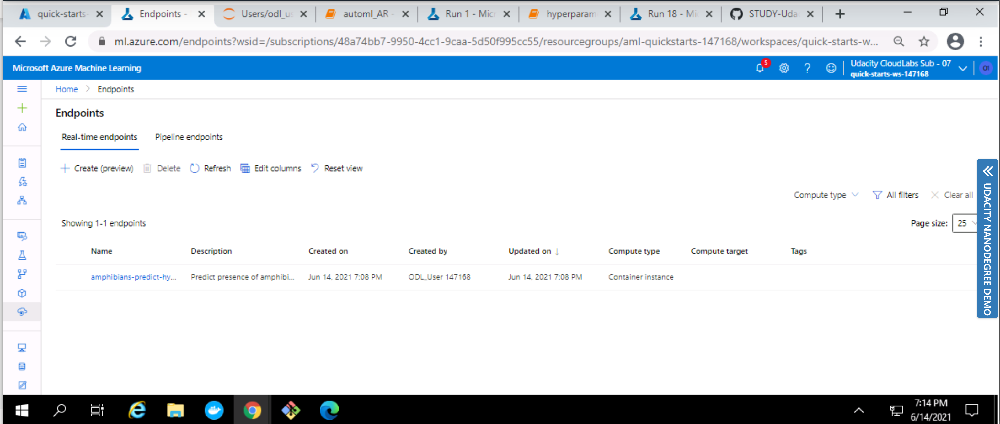

- Screenshot showing the model **endpoint** is active:

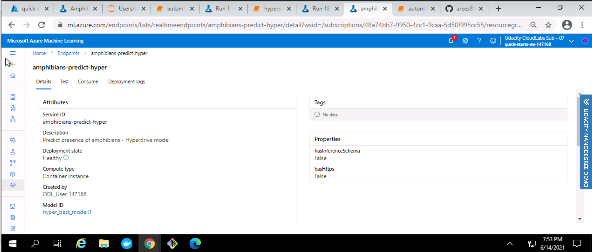

- Screenshot showing the model endpoint URIs:

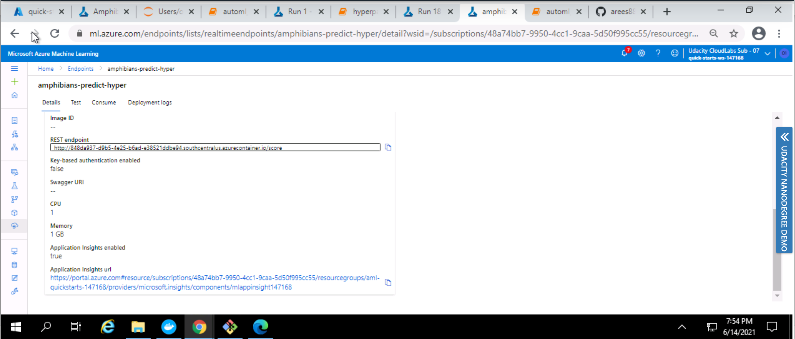

- Screenshot showing the sample data used to test the deployed model:

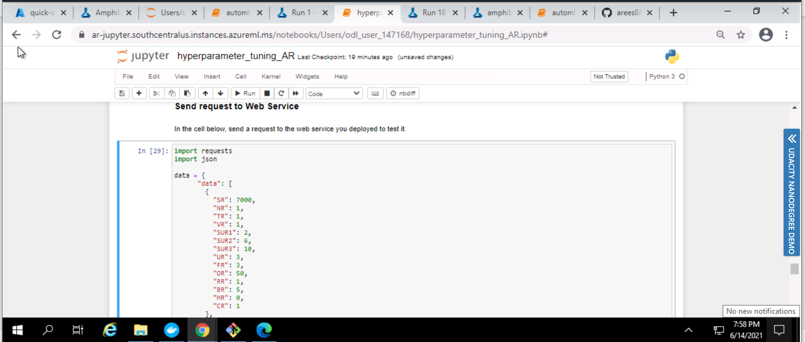

[//]: # (screenshots/7.2_Request_Data__Zoom_121951885-68d98e80-cd53-11eb-955c-e0a68eb142dc.png)

- Screenshot showing the inference request sent to the deployed model and the prediction results returned:

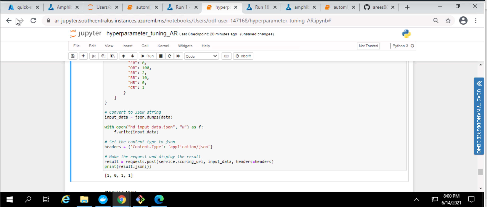

[//]: # (screenshots/7.4_Hyper_Test_Results_Zoom_121952024-9a525a00-cd53-11eb-8435-b3d72ba6d987.png)

- Screenshot of web service logs after the request was sent to the endpoint:

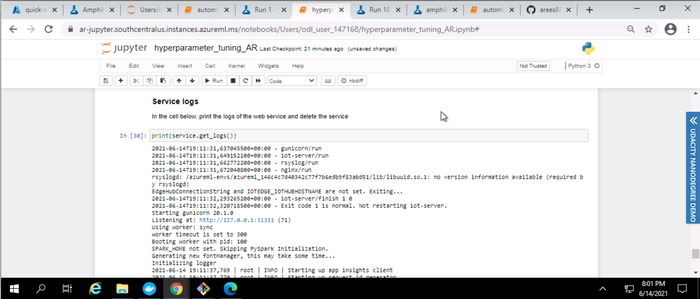

[//]: # (screenshots/7.6_Endpoint_Logs_Zoom_121952156-c8d03500-cd53-11eb-80ab-7d08a6b86adc.png)


<br/>

## **Screen Recording**
*TODO* Provide a link to a screen recording of the project in action. Remember that the screencast should demonstrate:

This section includes the link to the project screencast. The screencast shows the entire process of the working ML application, including a demonstration of:

- A working model
- Demo of the deployed  model
- Demo of a sample request sent to the endpoint and its response
- Demo of converting model to ONNX format and using ONNX runtime

Video is available at the following link: https://www.youtube.com/watch?v=Ueu9BC5kYeM

<br/>

## **Standout Suggestions**
*TODO (Optional):* This is where you can provide information about any standout suggestions that you have attempted.

### **Save Model in ONNX format**
As the additional task I have converted the best AutoML model to ONNX format. 

- **Retrieve the Best ONNX Model**

To retrieve the best ONNX model from the AutoML experiment run, we use the same __get_output__ method as above. 
In addition, the parameter __return_onnx_model__ has to be set to true to retrieve the best ONNX model, instead of the Python model:
```
best_run, onnx_model = remote_run.get_output(return_onnx_model=True)
```
Below is the screenshots of Jupyter notebook where the model from the best AutoML run was retrieved: 

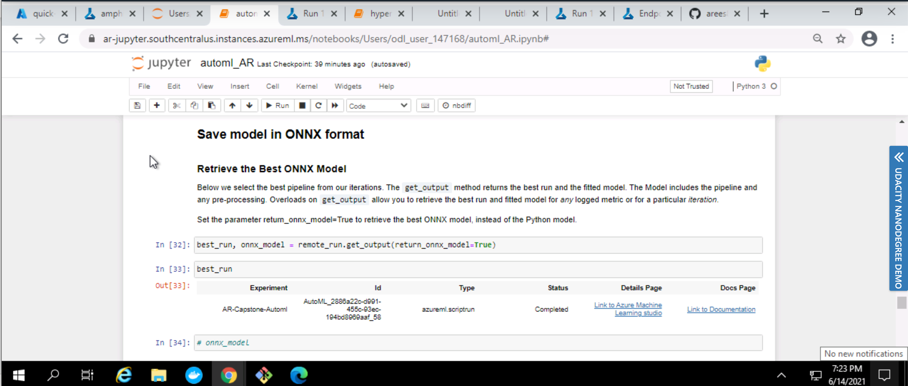

- **Save the Best ONNX Model**

To save the model in ONNX format we need to use the __OnnxConverter__ class with __save_onnx_model__ method to convert the model from pkl format to onnx format:
```
from azureml.automl.runtime.onnx_convert import OnnxConverter

onnx_path = out_dir + "/automl_best_model.onnx"
OnnxConverter.save_onnx_model(onnx_model, onnx_path)
```
Below screenshot show the code that converts the model to the ONNX format and saves to a file:

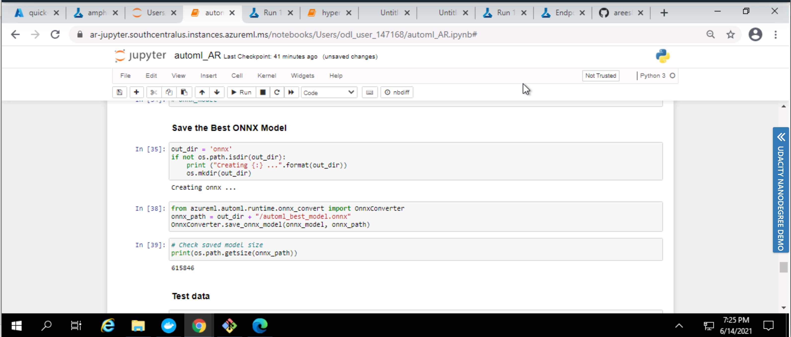

[//]: # (screenshots/8.3_Save_ONNX_model_Zoom_121948142-c7503e00-cd4e-11eb-9929-586fbcd62d96.png)


- **Predict with ONNX Model**

I have saved four data samples in the CSV file __Amphibians_testset.csv__ and used **Tabular** to convert it to Dataset for input to ONNX model:
```
test_data = "https://raw.githubusercontent.com/arees88/ML_Azure_P3_Capstone/main/Amphibians_testset.csv"
test_dataset = Dataset.Tabular.from_delimited_files(test_data)
```
The screenshot below shows the test data used for the ONNX model predictions:

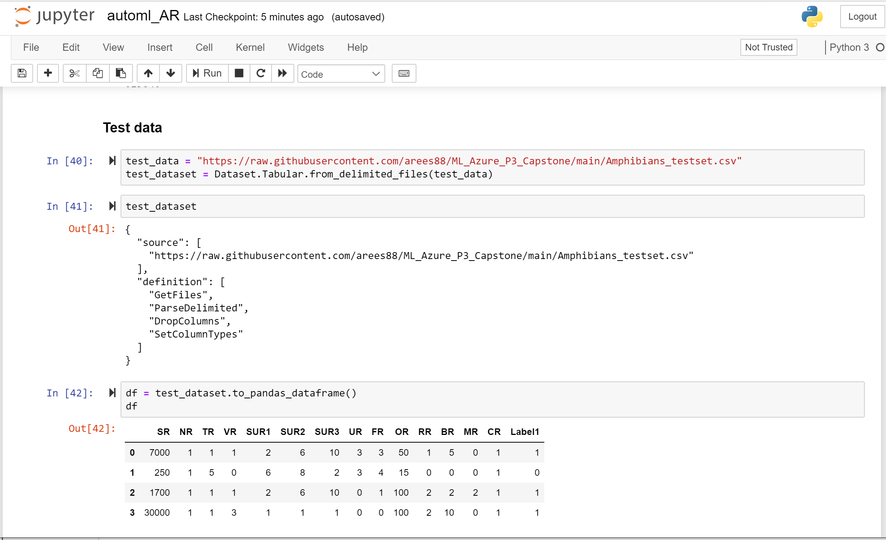

The code below shows how to get the necessary ONNX resources and then use the __onnxruntime__ package and __OnnxInferenceHelper__ class to get predictions with ONNX model:
```
	import onnxruntime
	from azureml.automl.runtime.onnx_convert import OnnxInferenceHelper

	def get_onnx_res(run):
	    res_path = 'onnx_resource.json'
	    run.download_file(name=constants.MODEL_RESOURCE_PATH_ONNX, output_file_path=res_path)
	    with open(res_path) as f:
		onnx_res = json.load(f)
	    return onnx_res

	if python_version_compatible:
	    test_df = test_dataset.to_pandas_dataframe()
	    mdl_bytes = onnx_model.SerializeToString()
	    onnx_res = get_onnx_res(best_run)

	    onnxrt_helper = OnnxInferenceHelper(mdl_bytes, onnx_res)
	    pred_onnx, pred_prob_onnx = onnxrt_helper.predict(test_df)

	    print(pred_onnx)
	    print(pred_prob_onnx)
	else:
	    print('Please use Python version 3.6 or 3.7 to run the inference helper.')
```
The screenshot below shows the predictions and the probabilities returned by the ONNX model:

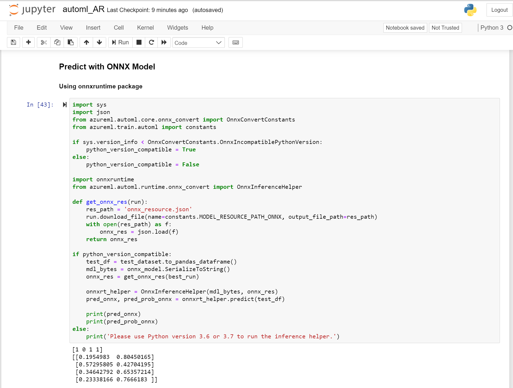

<br/>

## Future Suggestions

As mentioned in the previous section, both experiments in the project had restricted number of iterations when searching for best model performance.

In the case of HyperDrive experiment we used Random sampling and restricted the number of iterations to 20. Using higher number of iterations with more Random sampler choices may help with finding a set of hyperparameters that give better performance. To make sure that we don't miss the best performing hyperparameter settings we could swith to Grid sampling instead. Choosing a diffrent early termination policy may also help by providing savings without terminating promising jobs. For example using the more conservative Median Stopping Policy rather than BanditPolicy.

With the AutoML option we restricted the experiment time to 30 minutes which allowed for 28 models to be explored. Increasing the experiment time would potentially allow to find another, better performing model.

The **Amphibians Data Set** is multilabel and can be used to predict the presence of seven different amphibian species in water reservoirs. 
I have used Label1 to predict the presence of the Green frogs. We could use the ramaining labels, Label2 to Label7, to predict the presence of the other amphibian species such as Brown frogs, Common toad, Fire-bellied toad, Tree frog, Common newt and Great crested newt.

Swagger is the tool that helps to build, document, and consume RESTful web services deployed in the Azure ML Studio. 
It explains what types of HTTP requests the API can consume, e.g. POST and GET, the request parameters it takes and the return values. 
To configure Swagger we need to obtain the Swagger definition file.
Nomally Azure provides the swagger.json file, which is used to create the web site that documents the HTTP endpoint, for the models deployed in ML Studio.
This can be downloaded from the Swagger URI section of the Endpoint screen of the deployed model.
When we deploy Azure models from the Jupyter notebooks using the **AciWebservice** Class, the swagger configuration file is not automatically generated.
It would be good to find out how the Swagger configuration can be generated for the Endpoints deployed via the Jupyter notebooks as well.

<br/>

## References

- Amphibians Data Set, Machine Learning Repository, Center for Machine Learning and Intelligent Systems, University of California, Irvine (http://archive.ics.uci.edu/ml/datasets/Amphibians)
- AutoMLConfig Class, Microsoft Azure (https://docs.microsoft.com/en-us/python/api/azureml-train-automl-client/azureml.train.automl.automlconfig.automlconfig?view=azure-ml-py)
- HyperDriveConfig Class, Microsoft Azure (https://docs.microsoft.com/en-us/python/api/azureml-train-core/azureml.train.hyperdrive.hyperdriveconfig?view=azure-ml-py)
- ScriptRunConfig Class, Microsoft Azure (https://docs.microsoft.com/en-us/python/api/azureml-core/azureml.core.scriptrunconfig?view=azure-ml-py)
- Hyperparameter tuning with Azure Machine Learning (https://docs.microsoft.com/azure/machine-learning/service/how-to-tune-hyperparameters#specify-an-early-termination-policy)
- Scikit-learn Random Forest Classifier (https://scikit-learn.org/stable/modules/generated/sklearn.ensemble.RandomForestClassifier.html)
- OnnxConverter Class, Microsoft Azure (https://docs.microsoft.com/en-us/python/api/azureml-automl-runtime/azureml.automl.runtime.onnx_convert.onnx_converter.onnxconverter?view=azure-ml-py)

